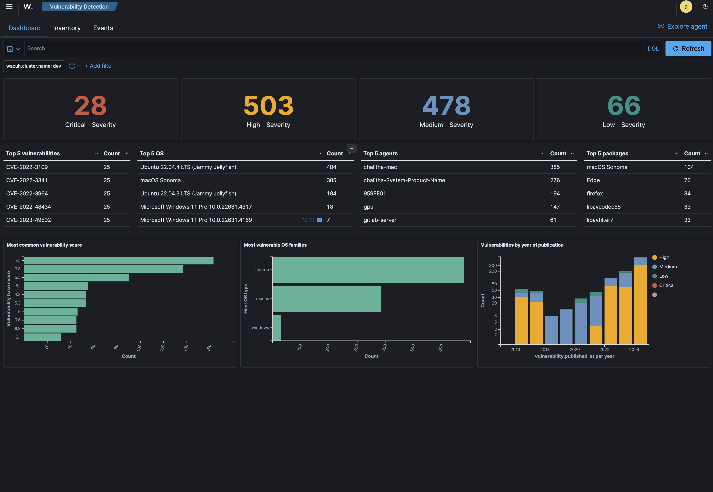
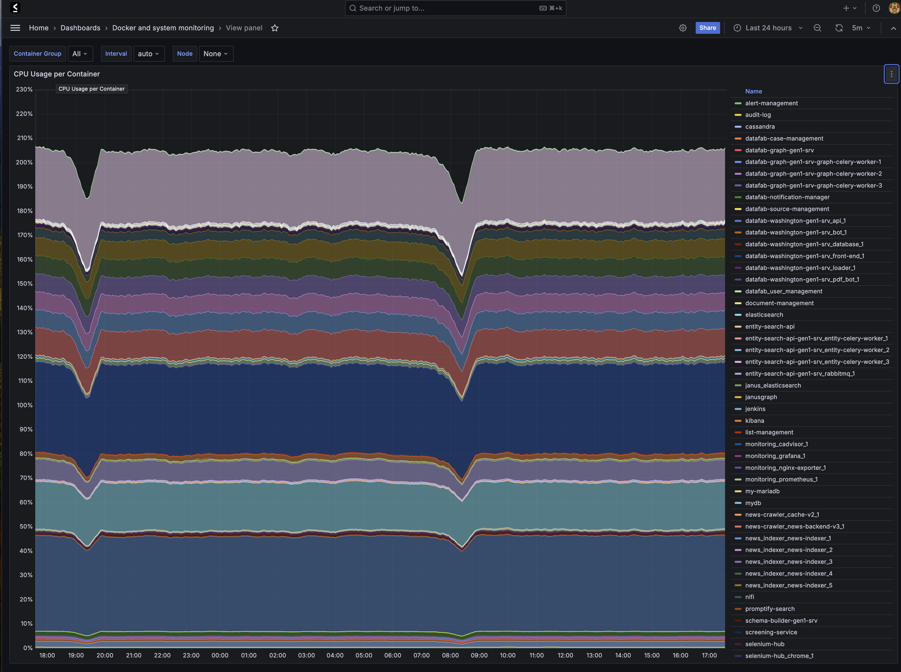
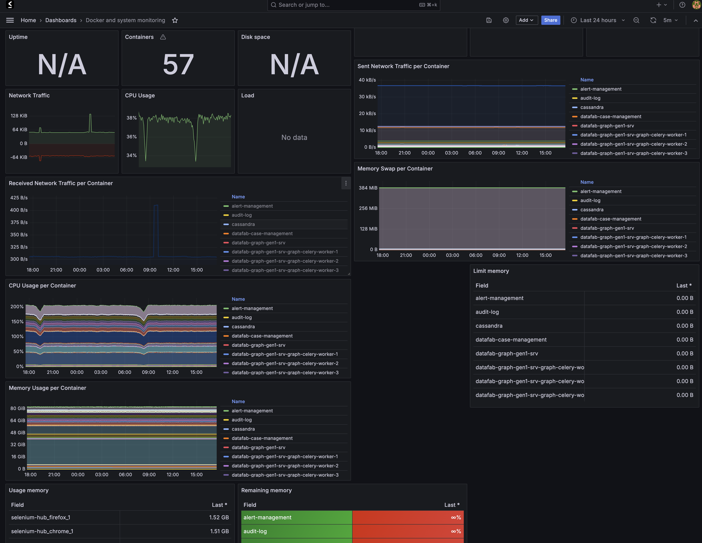

# LegalFab Security Operations

**Version:** 1.0
**Last Updated:** January 2026

---

## Security Monitoring

### Security Operations Center (SOC)

The SOC provides centralized monitoring and management of security operations.

**Key Functions:**

| Function              | Description                                |
| :-------------------- | :----------------------------------------- |
| Continuous Monitoring | 24/7 monitoring of security events         |
| Incident Detection    | Automated detection and alerting           |
| Threat Intelligence   | Gathering and analysis of threat data      |
| Incident Response     | Coordinated response to security incidents |
| Compliance Monitoring | Ongoing compliance verification            |

### Monitoring Coverage

| Area | Monitoring Capabilities |
|:-----|:------------------------|
| Vulnerability Management | Continuous scanning, prioritization, remediation tracking |
| Attack Detection | Real-time monitoring, anomaly detection, threat intelligence |
| Compliance Monitoring | GDPR, SOC 2 compliance auditing |
| Code Leakage Prevention | Repository monitoring, DLP solutions |
| Malware Detection | Real-time scanning, behavioral analysis |

---

## Endpoint Protection

### Mobile Device Management (MDM)

| Capability | Implementation |
|:-----------|:---------------|
| Centralized Management | All company devices managed centrally |
| Policy Enforcement | Security policies enforced on all endpoints |
| Remote Wipe | Lost/stolen device data protection |
| Patch Management | Automated security updates |

### Extended Detection and Response (XDR)

| Capability | Implementation |
|:-----------|:---------------|
| Cross-Platform Correlation | Security data correlated across endpoints, network, cloud |
| AI-Powered Detection | ML-based threat detection |
| Automated Response | Automated incident response workflows |
| Forensics | Detailed investigation tools |

### Device Control

| Control | Implementation |
|:--------|:---------------|
| USB Restriction | External storage controlled |
| Granular Policies | Device-specific access rules |
| Activity Logging | Connection attempts logged |
| Exception Management | Monitored temporary access |

---

## Monitoring Infrastructure

### Metrics Collection

| Component | Metrics |
|:----------|:--------|
| Infrastructure | CPU, memory, disk, network |
| Application | Request rates, error rates, latencies |
| Database | Query performance, connections, replication |
| Security | Authentication events, access patterns |

### Log Management

| Control | Implementation |
|:--------|:---------------|
| Centralized Collection | All logs aggregated centrally |
| Secure Storage | Logs encrypted at rest |
| Retention | Configurable retention per log type |
| Analysis | SIEM integration for analysis |

### Alerting

| Severity | Response Time | Notification |
|:---------|:--------------|:-------------|
| Critical | 15 minutes | Immediate escalation |
| High | 1 hour | On-call notification |
| Medium | 4 hours | Team notification |
| Low | 24 hours | Queue for review |

---

## Incident Response

### Incident Classification

| Severity | Definition | Examples |
|:---------|:-----------|:---------|
| Critical | Active breach, data exfiltration | Unauthorized data access, ransomware |
| High | Potential breach, significant vulnerability | Suspicious activity, critical CVE |
| Medium | Security policy violation | Misconfiguration, failed access attempts |
| Low | Security improvement needed | Audit finding, best practice deviation |

### Response Phases

| Phase | Activities | Responsible Party |
|:------|:-----------|:------------------|
| Detection | Alert triage, initial assessment | Security Operations |
| Containment | Isolate affected systems, preserve evidence | Security + Engineering |
| Eradication | Remove threat, patch vulnerability | Engineering |
| Recovery | Restore services, validate security | Engineering + Security |
| Post-Incident | Root cause analysis, lessons learned | Security + Management |

### Communication Plan

| Stakeholder | Notification Timing | Method |
|:------------|:--------------------|:-------|
| Internal Security Team | Immediate | Alert system, chat |
| Engineering Leadership | Within 1 hour (Critical/High) | Direct communication |
| Affected Customers | Per SLA and regulation | Email, portal notification |
| Regulators | Per regulatory requirement | Formal notification |

---

## Business Continuity

### Recovery Objectives

| Component | RPO | RTO |
|:----------|:----|:----|
| Knowledge Graph | 1 hour | 4 hours |
| API Services | N/A (stateless) | 15 minutes |
| Credential Vault | 1 hour | 2 hours |
| Audit Logs | 15 minutes | 4 hours |

### Backup Strategy

| Data Type | Frequency | Retention | Storage |
|:----------|:----------|:----------|:--------|
| Database | Hourly | 30 days | Geo-redundant |
| Configuration | On change | 90 days | Version control |
| Audit Logs | Continuous | 1 year | Immutable storage |
| Credentials | On change | N/A | Encrypted vault |

### Disaster Recovery

| Scenario | Recovery Procedure | Target Time |
|:---------|:-------------------|:------------|
| Single Service Failure | Auto-restart, failover | Minutes |
| Zone Failure | Traffic redirect to backup zone | 15 minutes |
| Region Failure | Failover to secondary region | 4 hours |
| Data Corruption | Restore from backup | 4-8 hours |

---

## Security Training

### Awareness Program

| Training Type | Frequency | Audience |
|:--------------|:----------|:---------|
| Security Awareness | Annual | All employees |
| Phishing Simulation | Quarterly | All employees |
| Secure Development | Annual | Development team |
| Incident Response | Annual | Response team |

### Training Topics

- Password and authentication security
- Phishing recognition
- Data handling and classification
- Incident reporting procedures
- Secure coding practices
- Compliance requirements

---
